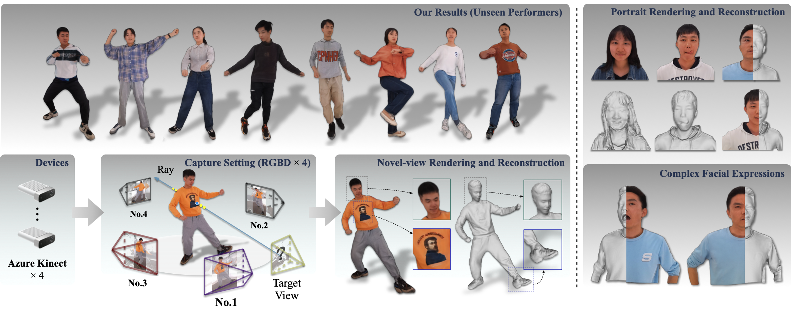
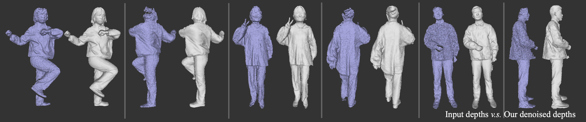
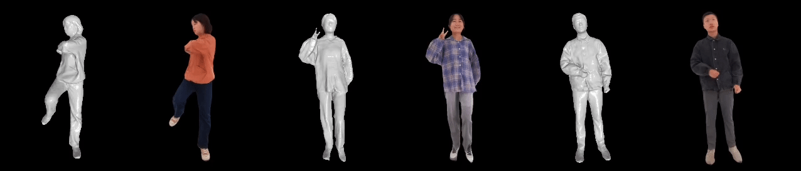

<h2 align="center">SAILOR: Synergizing Radiance and Occupancy Fields for Live Human Performance Capture</h2>

<div align="center"><i><a href='http://zdlarry.github.io'>Zheng Dong</a>, Xu Ke, Yaoan Gao, Qilin Sun, Hujun Bao, Weiwei Xu*, Rynson W.H. Lau
</br>
 <b>SIGGRAPH ASIA 2023</b></i></div>


<p align="center">SAILOR is a generalizable method for human free-view rendering and reconstruction from <b>very sparse (<i>e.g.</i>, 4) RGBD streams </b>, achieving <b>near real-time</b> performance under acceleration.</p>


<p align="center">Our free-view rendering results and bullet-time effects on our real-captured dataset (<b>Unseen performers </b>).</p>

<p align="center">
<a href="https://pytorch.org/get-started/locally/"></a>
<a href="https://developer.nvidia.com/cuda-toolkit"></a>
<br/>
<a href=''>
    
</a>
<a href='' style='padding-left: 0.5rem;'>
      </a>
<a href="https://www.youtube.com/watch?v=88tX22Z0Dz0" style='padding-left: 0.5rem;'></a>
<a href="#license" style='padding-left: 0.5rem;'></a>
<a href="#citation" style='padding-left: 0.5rem;'></a>
</p>

---

## Installation

Please install python dependencies in `requirements.txt`:
```$
conda create -n SAILOR python=3.8
conda activate SAILOR
pip install torch==1.8.0+cu111 torchvision==0.9.0+cu111 -f https://download.pytorch.org/whl/torch_stable.html
pip install -r requirements.txt
```
Install the surface localization algorithm named [ImplicitSeg](https://github.com/Project-Splinter/ImplicitSegCUDA) provided by [MonoPort](https://github.com/Project-Splinter/MonoPort), for our fast post-merging operation.

Our code has been tested under the following system :
- Ubuntu 18.04, 20.04 or 22.04
- Python 3.8 and PyTorch 1.8.0
- GCC/G++ 9.5.0
- Nvidia GPU (RTX 3090) CUDA 11.1 CuDNN

Build the c++ and CUDA libraries:
- VoxelEncoding, FastNerf and Mesh-RenderUtil: ```cd c_lib/* && python setup.py install```. VoxelEncoding provides the CUDA accelerated versions of <b>TSDF-Fusion</b>, <b>two-layer tree construction</b>, <b>ray-voxel intersection</b>, <b>adaptive points sampling</b>, etc. FastNerf provides a <b>fully-fused</b> version of the MLPs and Hydra-attention for our SRONet.
- AugDepth and Depth2Color [optional] (Eigen3, OpenCV, OpenMp and pybind11 are required): 
```$ 
cd c_lib/* 
mkdir build && cd build
cmake .. && make
```

## Setup
- Clone or download this repo
- Download our pretrained depth denoising model (```latest_model_BodyDRM2.pth```) and our rendering model (```latest_model_BasicRenNet.pth```) <b>[here](https://drive.google.com/drive/folders/1K39fWyGXOwocUCCJQyYd5YIwqHLrmWkl)</b>
- Move the downloaded models to ```./checkpoints_rend/SAILOR``` folder

## Usage
The example static test data is provided in ```./test_data```, the data structure of static (or dynamic) is listed as :
```bash
<dataset_name>
|-- COLOR
    |-- FRAMExxxx
        |-- 0.jpg       # input RGB image (1024x1024) for each view
        |-- 1.jpg
        ...
|-- DEPTH
    |-- FRAMExxxx
        |-- 0.png       # input depth image (1024x1024, uint16, unit is m after dividing by 10000) for each view
        |-- 1.png
        ...
|-- MASK
    |-- FRAMExxxx
        |-- 0.png       # input human-region mask (1024x1024) for each view
        |-- 1.png
        ...
|-- PARAM
    |-- FRAMExxxx
        |-- 0.npy       # camera intrinsic ('K': 3x3) and pose ('RT': 3x4) matrices for each view
        |-- 1.npy
```
<br/>

<b>Depth denoising</b> : 
- <b style="color:yellow">Run ```python -m depth_denoising.inference```</b>
- The original and denoised point clouds are in the ```./depth_denoising/results``` folder. Use [meshlab](https://www.meshlab.net/) to visualize the 3D results
- Modify ```basic_path```, ```frame idx``` and ```view_id``` in the file ```inference.py``` to obtain the results of other examples



<br/>

<b>SRONet and SRONetUp</b> :
- For provided static data, <b style="color:yellow">run ```python -m upsampling.inference_static --name SAILOR```</b> (in 1K resolution) or <b>```python -m SRONet.inference_static --name SAILOR```</b> (in 512 resolution), to obtain the reconstructed 3D mesh and free-view rendering results.
- The reconstructed 3D meshes are in the ```./checkpoints_rend/SAILOR/val_results``` folder. To render the 3D mesh, run ```python -m utils_render.render_mesh``` to obtain the free-view mesh rendering results. Modify ```opts.ren_data_root```, ```obj_path``` and ```obj_name``` in the file ```render_mesh.py``` to get new results.
- For dynamic data, first download our <b>real-captured data [here](https://drive.google.com/drive/folders/1p3oQY5qxUnzLMJXHfrrrSPxWAHP_t2wr)</b>, unzip the data and put them in the ```./test_data``` folder
- For dynamic data, then <b style="color:yellow">run ```python -m upsampling.inference_dynamic --name SAILOR```</b> or <b>```python -m SRONet.inference_dynamic --name SAILOR```</b> to obtain the rendering results.
- Modify ```opts.ren_data_root``` and ```opts.data_name``` in ```inference_static.py``` and ```inference_dynamic.py``` to obtain new rendering results
- The rendering images and videos are in the ```./SRONet(or upsampling)/results``` folder.



<br/>

<b>Interactive rendering</b> :

We release our interactive rendering GUI for our real-captured dataset.
- TensorRT is required to accelerate our depth denoising network and the encoders in SRONet(upsampling). Please refer to [TensorRT installation guide](https://docs.nvidia.com/deeplearning/tensorrt/install-guide/index.html) and then install [torch2trt](https://github.com/NVIDIA-AI-IOT/torch2trt). Our TensorRT version is 7.2
- Run ```python -m depth_denoising.toTensorRT```, ```python -m SRONet.toTensorRT``` and ```python -m upsampling.toTensorRT``` to obtain the TRTModules (the param ```opts.num_gpus``` in ```toTensorRT.py``` controls the number of GPUs). The final pth models are in the ```./SAILOR/accelerated_models``` folder
- <b style="color:yellow">Run ```python -m gui.gui_render```</b>. Modify the ```opts.ren_data_root``` in ```gui_render.py``` to test other data, and modify the ```opts.num_gpus``` to use 1 GPU (slow) or 2 GPUs. The GIF below shows the rendering result of using 2 Nvidia RTX 3090, an Intel i9-13900k, and an MSI Z790 god-like motherboard

<div align="center"></div>

## License

The code, models, and GUI demos in this repository are released under the [GPL-3.0](https://www.gnu.org/licenses/gpl-3.0.html) license.

## Citation

If you find our work helpful to your research, please cite our paper.


